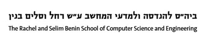
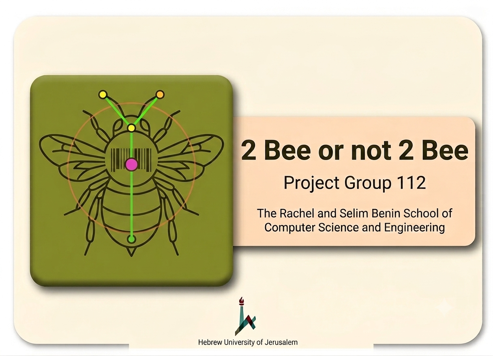

    

# 🐝 2 Bee or not 2 Bee
## AI-Powered Computer Vision for Automated Bee Behavior Detection



Current studies of bee behavior depend on manual observation, which is slow, subjective, and hard to scale. Detecting dominance behaviors requires constant expert attention. **2 Bee or not 2 Bee** is an automated computer vision system developed to detect and classify dominance interactions in controlled bee environments, enabling efficient, scalable behavioral monitoring for researchers.

## Table of Contents
- [The Team](#-the-team)
- [Project Description](#-project-description)
- [Getting Started](#-getting-started)
  - [Prerequisites](#prerequisites)
  - [Installing](#installing)
- [Usage (Running the Pipeline)](#-usage-running-the-pipeline)
  - [GUI Application](#gui-application)
  - [Command Line Interface (CLI)](#command-line-interface-cli)
  - [Interaction Detection Only (Skipping Pose Estimation)](#interaction-detection-only-skipping-pose-estimation)
- [Built With](#-built-with)
- [Acknowledgments](#-acknowledgments)

## 👥 The Team 
**Team Members**
- [Matan Pasternak](mailto:matan.pasternak@mail.huji.ac.il)
- [Itamar Morag](mailto:itamar.morag@mail.huji.ac.il)

**Advisors (Alexander Silberman Institute of Life Sciences)**
- [Guy Bloch](mailto:guy.bloch@mail.huji.ac.il)
- [Tzvi Goldberg](mailto:tzvi.goldberg@mail.huji.ac.il)

**Mentor**
- [Gal Katzhendler](mailto:gal.katzhendler@mail.huji.ac.il)

**Project Links**
- [GitHub Repository](https://github.com/matanpasternak-huji/i-love-my-hive)
- [Notion Workspace](https://www.notion.so/0570d5c275714c9ca78f799f8f9a4c5b)

## 📚 Project Description
This project replaces the need for massive amounts of annotated behavioral data by combining robust pose-estimation neural networks with a novel, **deterministic geometry-based algorithm**. 

The software pipeline consists of the following stages:
1. **Pose Estimation:** Fine-tuned SLEAP models detect bee body parts (head, abdomen, antennae).
2. **Identity Tracking & Correction:** NAPS tracking leverages ArUco barcodes attached to the bees to maintain identities through occlusions.
3. **Data Conversion:** Corrected tracks are exported to standardized CSV formats.
4. **Interaction Detection:** A custom deterministic engine evaluates spatial keypoints frame-by-frame, defining interactions via antennation and determining dominance outcomes using dynamic thresholding ($D_{EXIT}$).
5. **Group Splitting:** Interactions are automatically clustered into distinct petri dish groupings using a Union-Find algorithm.

## ⚡ Getting Started

These instructions will get a copy of the project up and running on your local machine for analysis and development.

### 🧱 Prerequisites
**⚠️ IMPORTANT:** This project strictly requires **Python 3.10**. Other versions may cause compatibility issues with SLEAP and NAPS dependencies.

Required Python packages:
- `opencv-python`
- `pandas`
- `numpy`
- `PyQt5`
- `sleap`
- `naps-track`

### 🏗️ Installing
1. Clone the repository:
   ```bash
   git clone https://github.com/matanpasternak-huji/i-love-my-hive.git
   cd i-love-my-hive
   ```
2. Create and activate a Python 3.10 virtual environment:
   ```bash
   conda create -n hive_env python=3.10
   conda activate hive_env
   ```
3. Install the dependencies:
   ```bash
   pip install -r requirements.txt
   ```

## 🚀 Usage (Running the Pipeline)

Before running the pipeline, ensure your video is prepared according to lab protocols (4x4 ArUco 0.5x0.5cm barcodes attached to the bees, and bees placed in petri dishes - two in each).

### GUI Application
For an accessible, user-friendly experience, launch the PyQt5 Desktop Application:
```bash
python gui.py
```
From the GUI, you can easily select your input video, configure pipeline parameters, monitor the process lifecycle, and visualize annotated outputs without using the command line.

### Command Line Interface (CLI)
You can run the full pipeline sequentially using `main.py`.

**Command Structure:**
```bash
python main.py --input <path to video> --output <output folder path>
```

**Example:**
```bash
python main.py --input ".\videos\set3_age3_group12 - Trim 1530.mp4" --output ".\output\"
```

The pipeline will output a list of predicted interactions, separated by petri dish group. The output CSV includes the entrance and exit frames, the identities of the winner and loser, the distance of each bee from the interaction center, and the termination reason.

### Interaction Detection Only (Skipping Pose Estimation)
If you already have a body-part tracking CSV (stage 3 output, e.g. `tracking_data.csv` from a previous run), you can run **only** the deterministic interaction-detection algorithm and skip the expensive SLEAP inference and NAPS correction stages entirely. This is the fastest way to re-analyse the same video with different detection thresholds.

**Command Structure:**
```bash
python find_interactions_by_antennation.py --video <path to video> --csv <path to tracking CSV> --output-dir <output folder path>
```

**Example:**
```bash
python .\find_interactions_by_antennation.py --video ".\videos\set3_age3_group12 - Trim 1530.mp4" --csv ".\output\20260816_003015\tracking_data_after_change.csv" --output-dir ".\output\20260822_160000"
```

The `--video` file must be the same video the CSV was generated from - it is used to render the annotated visualisation and to read frame dimensions.

**Optional tuning flags:**

| Flag | Description |
| --- | --- |
| `--touch-thresh` | Antennation distance threshold, in pixels. |
| `--min-touch-frames` | Minimum consecutive touching frames required to open an interaction. |
| `--d-exit-factor` | Multiplier for the dynamic exit threshold ($D_{EXIT}$). |
| `--max-frames` | Stop after this many frames (useful for quick trials). |
| `--no-show-live` | Do not open the live preview window while processing. |
| `--no-save-video` | Skip writing the annotated output video. |

## ⚙️ Built With
* [SLEAP](https://sleap.ai/) - Multi-animal pose tracking.
* [NAPS](https://github.com/kocherlab/naps) - N-body ArUco Pose-tracking System.
* [PyQt5](https://pypi.org/project/PyQt5/) - GUI Framework.
* [OpenCV](https://opencv.org/) - Video processing and visualization.

## 🙏 Acknowledgments
* **Tzvi Goldberg** for providing the extensive manual video annotations required for evaluation and ground-truth verification.
* The original developers of SLEAP (Pereira et al., 2022) and NAPS (Wolf et al., 2023).
